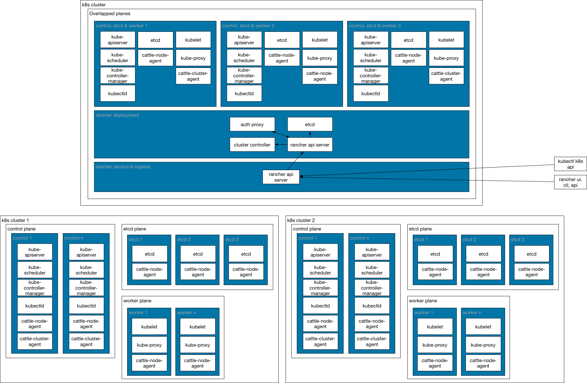
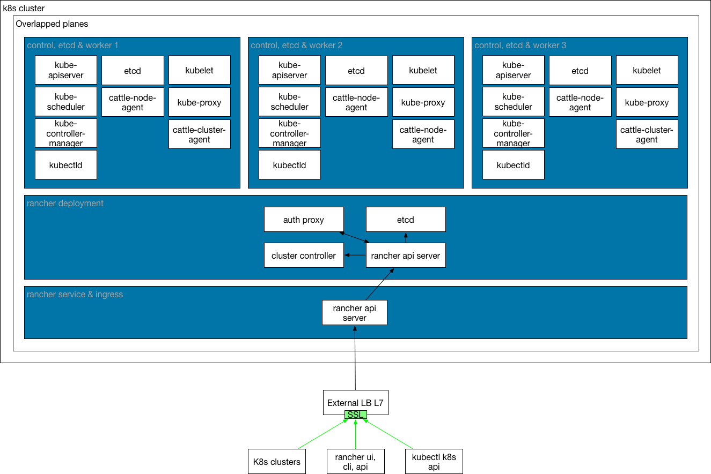
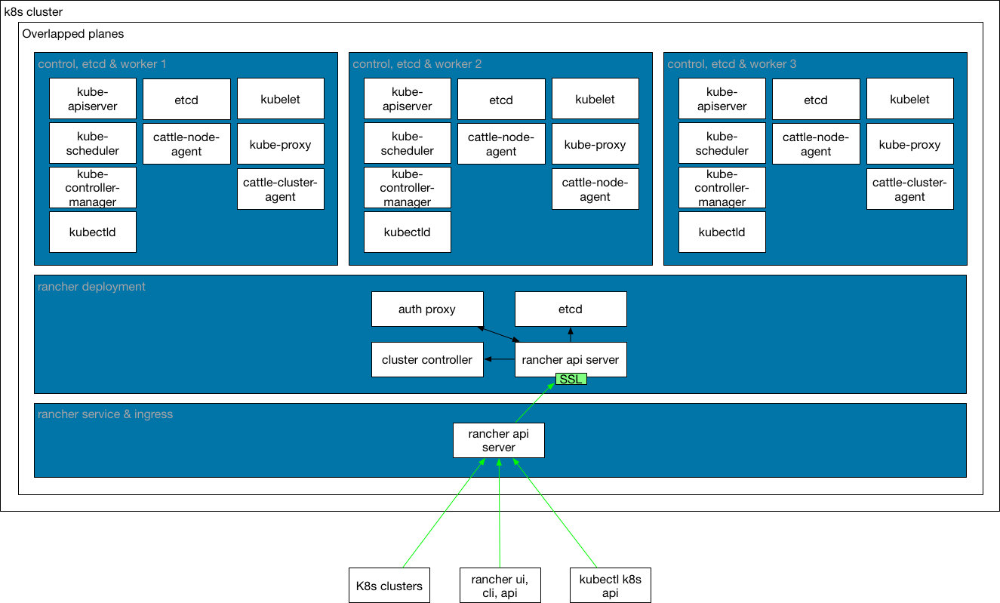

---

### Introduction

For production deployments, Rancher should be deployed in HA mode. 

Running Rancher HA mode means that rancher will be running as a k8s deployment in a k8s cluster. This provide Rancher deployment features like scale, upgrade, rollback... In this mode, access to rancher will be provided by k8s ingress controller. 

Rancher HA could be deployed as addon in an exclusive RKE cluster or in an already deployed k8s cluster.

Minimal of 3 nodes k8s cluster with overlapped planes is required.

### TLS

Rancher require tls for all inbound connections. It could be done directly, tls termination on Rancher, or by l7 lb, ingress, external lb's. It's needed that all clients (users, cli, cluster agents, node agents,...), trust on rancher tls certificates. There is no problem if tls certificates are signed by a well know public ca, but some considerations have to be done if a selfsigned ca is used.

If selfsigned certificates are used, cacert needs to be provided to rancher. By default /etc/rancher/ssl/cacerts.pem . Rancher will use it to provide a ca-checksum to cluster/nodes agents to trust in it. Rancher autogenerate its own tls certificates and ca if they are not provided. 

When Rancher is deployed in HA on a k8s/rke cluster, access to it is provided by ingress controller, a l7 load balancer. Ingress controller uses its own certificates by default. 

Additionally, external lb's could be used to provide access to Rancher. External lb's uses its own certificates by default.

### TLS-modes

Depending where tls termination is configured, 3 `tls-modes` could be used:

#### ingress

TLS termination is configured at k8s ingress. Connection between ingress and Rancher is proxied in clear. 

- Set FQDN dns round robin A entry pointing to RKE nodes ip's. Backend-health aware DNS like Route53, is recommended to provide true failover.
- Optionally, l4 load-balancer could be configured in front of ingress. If done, FQDN dns A entry should point to l4 load-balancer ip.
- K8s ingress will get configured with tls and FQDN site.
- Ingress requests to FQDN will be forwarded to rancher service in plain.

#### external

Tls termination is configured at external lb. Connection between external lb to ingress and finally Rancher is proxied in clear.

- Configure external LB with tls (ALB, nginx, haproxy) and FQDN site. L7 proxy.
- Set FQDN dns A entry pointing to external LB ip.
- External lb's request to FQDN will be forwarded to k8s ingress in plain.
- Ingress requests will be forwarded to rancher service in plain.
- CA cert is required if ca is selfsigned.

#### rancher

Tls termination is configured at Rancher pods. Connection is ciphered to Rancher.

- Set FQDN dns round robin A entry pointing to RKE nodes ip's. Backend-health aware DNS like Route53, is recommended to provide true failover.
- K8s ingress will get configured with FQDN site.
- Ingress requests to FQDN will be forwarded to rancher service in https.
- We should point out that DNS round-robin does not provide true failover (unless you use a backend-health aware DNS like Route53). And that we recommend to use a load-balancer in front of the Rancher K8s cluster.

### TLS Issuers

Rancher tls certs could be managed in distinct ways. Tls could be provided manually at deploy time, or cert-manager integration could be done with 2 distinct tls issuers. tls-issuers will be responsible to issue certificates and generate k8s secrets to make them available at ingress controller.

Depending how tls certs are managed, 3 `tls-issuers` could be used:

#### blank

This is the default issuer, tls certificates will be managed manually.

- Tls key and certificate should be provided at deploy time.
- CA cert is required if ca is selfsigned.

#### ca

CA issuer uses a own ca to generate and sign tls certificates. They will be managed by cert-manager with ca issuer.

- CA key and cert should be provided at deploy time.
- Tls certs will be generated and signed automatically by provided ca. 

#### acme

ACME issuer uses letsecnrypt to generate and sign tls certificates. They will be managed by cert-manager with acme issuer.

- acme-email is required.
- Tls certs will be generated and signed automatically by letsencrypt. 

### Deployment modes

#### <a href="./rancheronrke/">RancherOnRKE</a>

Rancher Kubernetes Engine (RKE) is a fast, versatile k8s installer that you can use to install k8s cluster on your Linux nodes. RKE cluster would be used exclusively to run rancher.

#### <a href="./rancheronk8s/">RancherOnK8S</a>

Using an already deployed k8s cluster for running rancher deployment on it. Using this way, k8s cluster could be shared to run rancher and other services.
