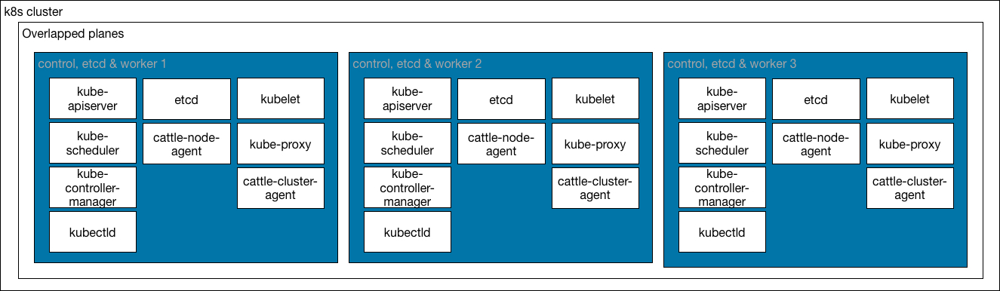
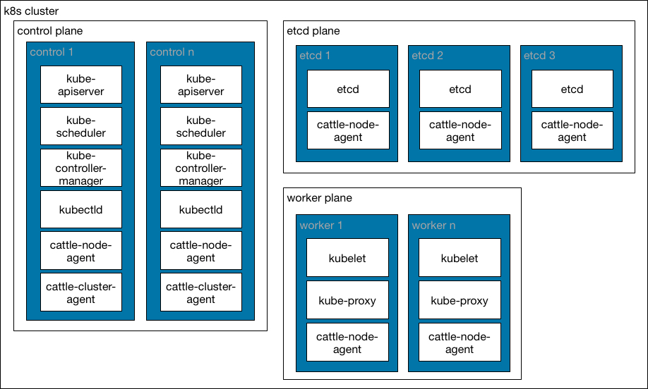

---

### Requirements

- running k8s cluster.
- rancher cli or helm command in OS path.
- kubectl cli command in OS path.
- TLS mode `external`: 
  - External LB running with SSL.
  - FQDN dns entry for rancher server pointing to external LB.
- TLS mode `ingress`: 
  - FQDN dns entry for rancher server pointing to k8s cluster nodes running ingress controller.
  - TLS issuer `<blank>`: TLS key and certificate. ca cert if selfsigned cafiles for your FQDN.
  - TLS issuer `ca`: CA key and cert.
  - TLS issuer `acme`: Letsencrypt email ID.
    

### K8S cluster

Rancher v2.0 could be deployed in a k8s cluster. 

Minimal k8s cluster deployment of 3 nodes with overlapped planes is required.



K8s cluster deployment of 7 nodes with separated planes is recommended.
- 3 nodes for running etcd plane.
- 2 nodes for running control plane
- 2 nodes for running worker plane.




### Using rancher cli (comming soon)

- Generate K8S rancher HA manifest. Execute:
  - tls-mode ingress: Ingress as SSL termination
    - Public CA
    
    ```
    rancher ha template --hostname <FQDN> --tls-key <KEY_FILE> --tls-cert <CERT_FILE> --output-mode k8s -o rancher-k8s-manifest.yml
    ```

    - Selfsigned CA
    
    ```
   rancher ha template --hostname <FQDN> --tls-key <KEY_FILE> --tls-cert <CERT_FILE> --tls-ca-cert <CA_FILE> --output-mode k8s -o rancher-k8s-manifest.yml
    ```

    - CA integrated `--tls-issuer ca` (Using cert-manager)
    
    ```
    rancher ha template --hostname <FQDN> --tls-mode ingress --tls-ca-cert <CA_CERT_FILE> --tls-ca-key <CA_KEY_FILE> --tls-issuer ca --output-mode k8s -o rancher-k8s-manifest.yml
    ```

    - Letsencrypt integrated `--tls-issuer acme` - staging (Using cert-manager)
     
    ```
    rancher ha template --hostname <FQDN> --tls-mode ingress --tls-issuer acme --tls-acme-email <EMAIL> --output-mode k8s -o rancher-k8s-manifest.yml
    ```

    - Letsencrypt integrated `--tls-issuer acme` - production (Using cert-manager)
    
    ```
    rancher ha template --hostname <FQDN> --tls-mode ingress --tls-issuer acme --tls-acme-email <EMAIL> --tls-acme-prod --output-mode k8s -o rancher-k8s-manifest.yml
    ```

  Note: If `--tls-issuer ca` or `--tls-issuer acme` cert-manager will be included at k8s generated manifest. 

  - tls-mode external: External LB as SSL termination
    - Public CA 

    ```
    rancher ha template --hostname <FQDN> --tls-mode external --output-mode k8s -o rancher-k8s-manifest.yml
    ```

    Selfsigned CA 

    ```
    rancher ha template --hostname <FQDN> --tls-mode external --tls-ca-cert <CA_CERT_FILE> --output-mode k8s -o rancher-k8s-manifest.yml
    ```

- K8s rancher HA manifest `rancher-k8s-manifest.yml` will be generated
- Backup K8s rancher HA manifest
- Configure `kubectl` to connect desired k8s cluster. 


To deploy rancher HA at k8s cluster, just run:

```
kubectl create -f rancher-k8s-manifest.yml
```

K8s cluster will publish rancher UI by ingress-controller on all running nodes and host FQDN. 

Rancher UI should be available at `https://FQDN`

### Using helm package

Rancher has develop a helm chart to deploy it in a k8s cluster. To use it you need to add Rancher helm repository.

```
helm repo add rancher https://releases.rancher.com/server-charts
```

More info about deploying at https://github.com/rancher/server-chart/README.md

TODO
