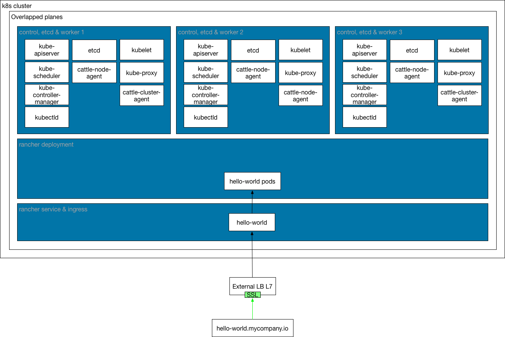

---

### Introduction

By default, applications deployed in a K8s cluster are only accessible from the overlay network within the cluster. To expose an application to clients outside of the cluster, a mechanism must be in place to route external requests to the pods providing the application. By default, access to every service deployed on k8s, is provided by ingress controller, a l7 load balancer.

Ingress controller used by default on Rancher is nginx. It provides and secure (if tls available) access to services by named virtual host or configuring default site to a service. 

By default, services are provided and secured by ingress controller, but some other scenarios could be configured. External lb's (hardware or software) could be used to provide access to services. 

### Scenarios

Depending of the architecture and where tls termination is configured, 3 distinct configuration could be used to provide access to services.

#### ingress

- No external lb's used. Optional external lb l4 could be used.. 
- Entrypoints and tls termination are configured at ingress controller. 
- Connection between ingress controller and services are proxied in clear. 
- All connections to services running at K8s cluster, are managed and secured by ingress controller. 
- Requirements:
  - FQDN for the service. 
  - FQDN dns round robin A entry pointing to k8s nodes ip's that are running ingress.
  - K8s ingress configured with tls and FQDN site.
  - Ingress requests to FQDN will be forwarded to k8s services in plain.

#### external-lb-L4

- Using external lb's on layer 4. 
- Entrypoints and tls termination are configured at ingress controller. 
- Connection between external lb to ingress are forwarded in layer 4.
- All connections to services running at K8s cluster, are managed and secured by ingress controller. 
- Requirements:
  - Configure external LB with tls (NLB, nginx, haproxy) and FQDN site. L4 proxy.
  - FQDN for the service.
  - FQDN dns A entry pointing to external LB ip.
  - External lb's request to FQDN will be forwarded to ingress in secure.
  - Ingress requests will be forwarded to k8s services in plain.

#### external-lb-L7

- Using external lb's on layer 7. 
- Entrypoints and tls termination are configured at external lb and  redirected to ingress controller. 
- Connection between external lb to ingress and finally services are proxied in clear.
- All connections to services running at K8s cluster, are managed and secured by external lb's. 
- Requirements:
  - Configure external LB with tls (ALB, nginx, haproxy) and FQDN site. L7 proxy.
  - FQDN for the service.
  - FQDN dns A entry pointing to external LB ip.
  - External lb's request to FQDN will be forwarded to ingress controller in plain.
  - Ingress requests will be forwarded to k8s services in plain.

