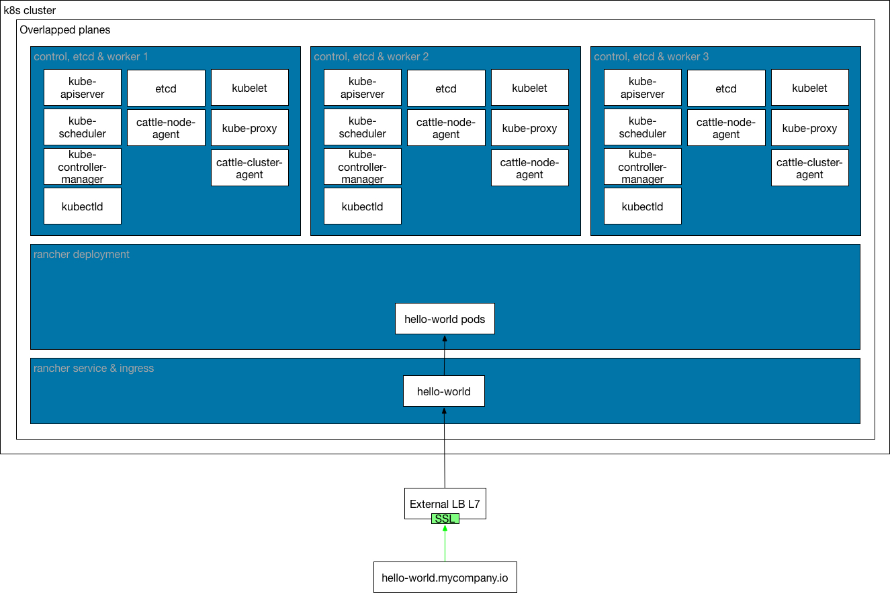
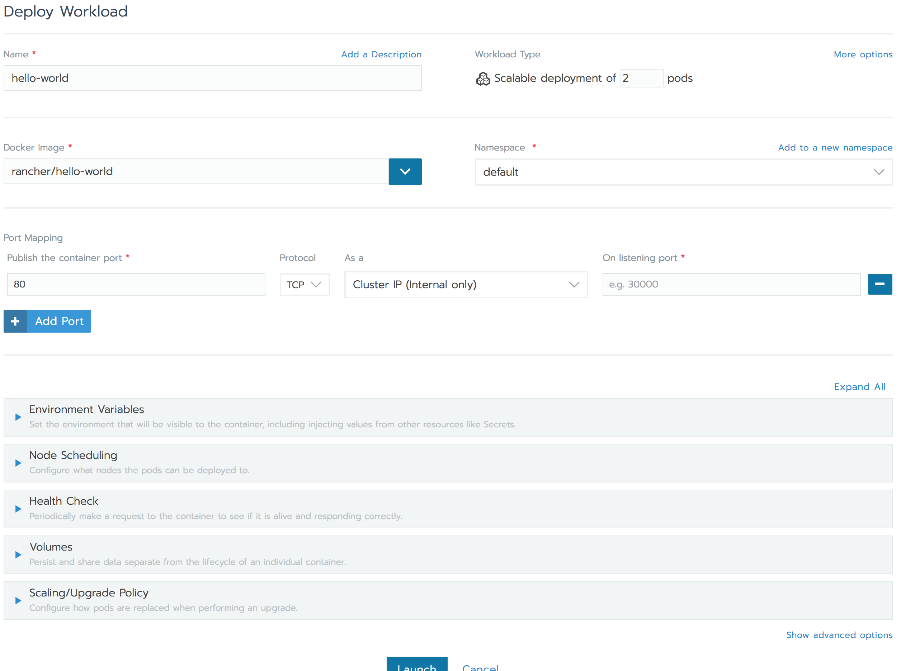
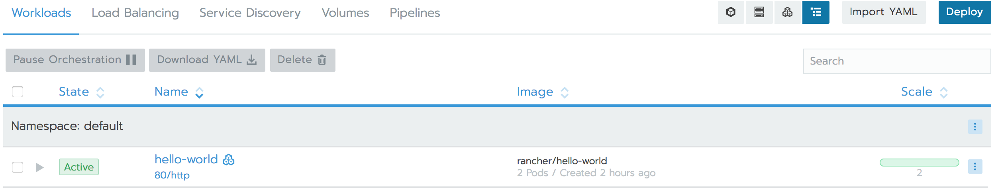
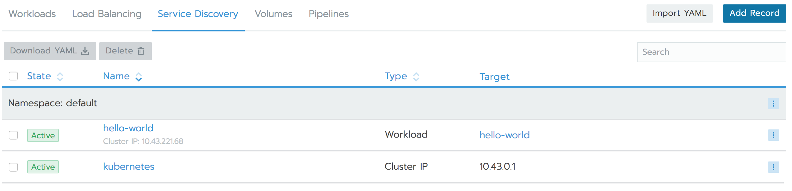
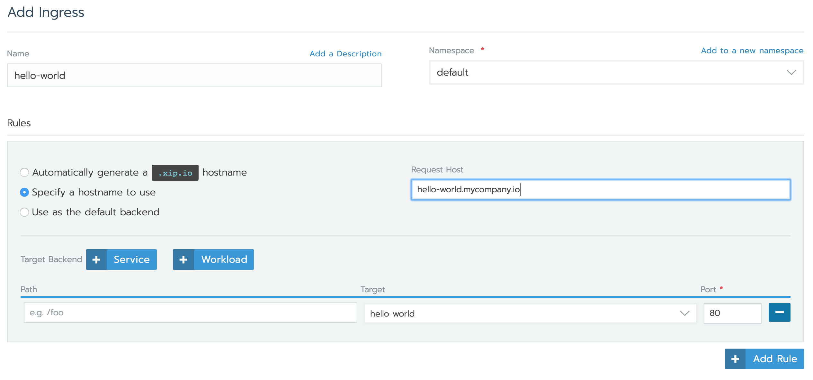
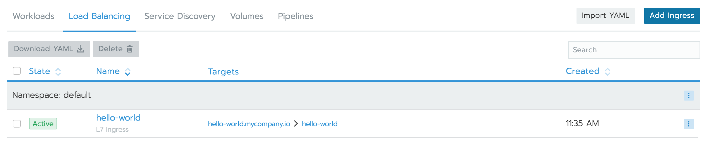
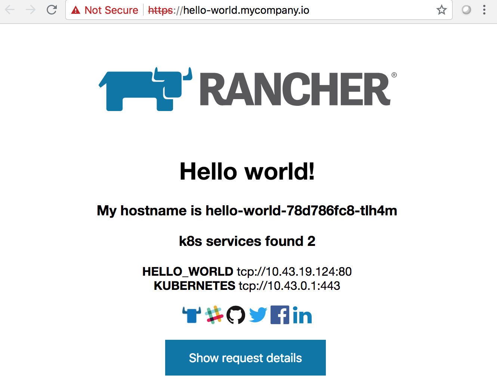
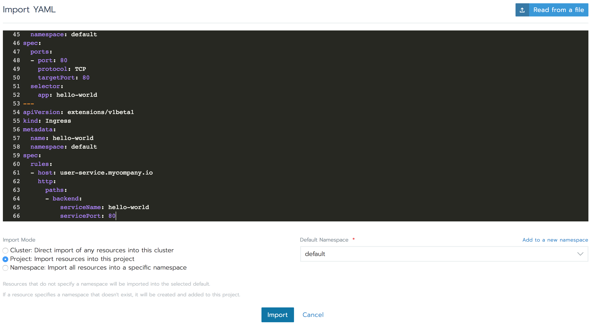
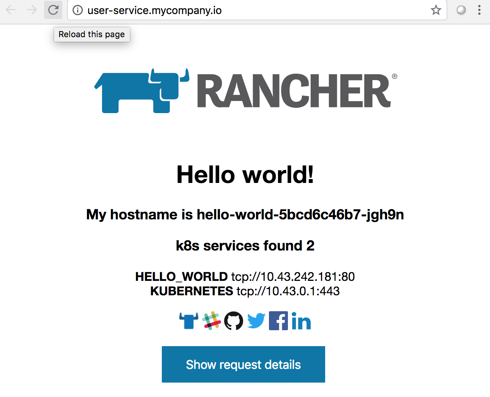

---

### Introduction

If you want to use external lb L7, (ALB, nginx, F5,...) to provide access to services running at k8s cluster, this would be the scenario.



TLS certificates and virtual servers are managed by external lb to connect to ingress controller services.

To maintain and operate this configuration, tls certs and FQDN's for every service, needs to be configured at external lb. External dns's entries for every FQDN should point to external lb ip's.

### TLS

If you want to secure the access to the service, you need to generate a TLS cert/key for every service `hello-world.mycompany.io` or generate a wildcard for a domain `*.mycompany.io`. It should be configured at external lb.

### Deploying

Let's see an example with a `hello-world` example.

A user wants to deploy and expose a `hello-world` service in rancher, with service fqdn `hello-world.mycompany.io`

#### Requirements
  - Rancher system with a deployed or imported k8s cluster.
  - DNS entry for service fqdn `hello-world.mycompany.io`, pointing to external lb ip's.
  - TLS certificate for `hello-world.mycompany.io` or wildcard for `*.mycompany.io`.

#### Deploy service from UI

  - At rancher ui, go to `Workload` page on your rancher project, and click on `Deploy` button. Scale 2 and using port mapping 80 as "cluster IP". 

  

  

  - Rancher will generate service automatically, due to port mapping was configured. If you don't configure port mapping, ingress rule will generate service in the form `INGRESS_*` 

  

  - Create ingress rule pointing to `hello-world` service and setting `hello-world.mycompany.io` requested host.

  

  

  - Once ingress is deployed, at workload view you should see new service entrypoint. This is the entrypoint where external lb needs to be redirected.

  

#### Importing yaml manifest
  - Service manifest, including deployment, service and ingress.

  ```
  apiVersion: apps/v1beta2
  kind: Deployment
  metadata:
    labels:
      app: hello-world
    name: hello-world
    namespace: default
  spec:
    replicas: 2
    selector:
      matchLabels:
        app: hello-world
    strategy:
      rollingUpdate:
        maxSurge: 1
        maxUnavailable: 0
      type: RollingUpdate
    template:
      metadata:
        labels:
          app: hello-world
      spec:
        containers:
        - image: rancher/hello-world
          imagePullPolicy: Always
          name: hello-world
          livenessProbe:
            failureThreshold: 3
            httpGet:
              path: /
              port: 80
              scheme: HTTP
            initialDelaySeconds: 10
            periodSeconds: 2
            successThreshold: 1
            timeoutSeconds: 2
          ports:
          - containerPort: 80
            protocol: TCP
  ---
  apiVersion: v1
  kind: Service
  metadata:
    name: hello-world
    namespace: default
  spec:
    ports:
    - port: 80
      protocol: TCP
      targetPort: 80
    selector:
      app: hello-world
  ---
  apiVersion: extensions/v1beta1
  kind: Ingress
  metadata:
    name: hello-world
    namespace: default
  spec:
    rules:
    - host: hello-world.mycompany.io
      http:
        paths:
        - backend:
            serviceName: hello-world
            servicePort: 80
  ```

  - At rancher ui, go to `Workload` page on your rancher project, and click on `Import YAML` button.

  Paste you deployment manifest or click `Read from file` button.

  

### External lb L7

As external lb at layer 7, you could use some options, AWS ALB, nginx, haproxy,...

Once you have depoyed the service, you should configure external lb to redirect request to ingress controller.

#### AWS ALB

  - Creating Target groups, one for for 80 HTTP and other for port 443 HTTPS.
  
  ```
  Port 80
  Target group name: hello-world-http-80
  Protocol: HTTP
  Port: 80
  Target type: Instance
  VPC: <YOUR_VPC>

  Health check settings
  Protocol: HTTP
  Path: /healthz

  Port 443
  Target group name: hello-world-https-443
  Protocol: HTTPS
  Port: 443
  Target type: Instance
  VPC: <YOUR_VPC>

  Health check settings
  Protocol: HTTPS
  Path: /healthz
  ```

  - Once target groups are created, select them one by one and  "Action" -> "Register and deregister targets”

  ```
  hello-world-http-80
  Select instances that are running ingress-controller in your k8s custer, click “Add to registered” on port 80 and "save"

  hello-world-https-443
  Select instances that are running ingress-controller in your k8s custer, click “Add to registered” on port 443 and “save"
  ```

  - Create a application load balancer

  ```
  Name: hello-world-http-https
  Scheme: internet-facing

  IP address type: ipv4

  Listeners
  Add 2 listeners:
  80 HTTP -> forwarding to hello-world-http-80
  443 HTTPS -> forwarding to hello-world-https-443 with TLS cert/key configured

  Availability Zones
  Select your VPC and availability zone

  Add Target groups for every listener.

  Configure Security Settings

  Configure Security Groups

  Configure Routing
  ```

  Check that `hello-world.mycompany.io` dns entry, points to your external ALB ip's.

#### NGINX

  - Deploy and configure your external nginx lb l7 to redirect request to FQDN to ingress ip's, and to use generated TLS cert/key. 

  ```
  upstream hello-world {
      server <ingress_ip1>;
      server <ingress_ip2>;
  }

  map $http_upgrade $connection_upgrade {
      default Upgrade;
      ''      close;
  }

  server {
      listen 443 ssl http2 default_server;
      server_name hello-world.mycompany.io;

      if ($host != $server_name) {
          return 301 https://$server_name$request_uri;
      }

      ssl_certificate <CERT_FILE>;
      ssl_certificate_key <KEY_FILE>;

      location / {
          proxy_set_header Host $host;
          proxy_set_header X-Forwarded-Host $host;
          proxy_set_header X-Forwarded-Port $server_port;
          proxy_set_header X-Real-IP $remote_addr;
          proxy_set_header X-Forwarded-Proto $scheme;
          proxy_set_header X-Forwarded-For $proxy_add_x_forwarded_for;
          proxy_set_header Upgrade $http_upgrade;
          proxy_set_header Connection $connection_upgrade;

          # mitigate HTTPoxy Vulnerability
          # https://www.nginx.com/blog/mitigating-the-httpoxy-vulnerability-with-nginx/
          proxy_set_header Proxy "";

          proxy_http_version 1.1;

          # This allows the ability for the execute shell window to remain open for up to 30 minutes. Without this parameter, the default is 1 minute and will automatically close.
          proxy_connect_timeout 30s;
          proxy_send_timeout 1800s;
          proxy_read_timeout 1800s;

          proxy_pass http://hello-world;
      }
  }

  server {
      listen 80;
      server_name hello-world.mycompany.io;
      return 301 https://$server_name$request_uri;
  }
  ```

  Check that `hello-world.mycompany.io` dns entry, points to your external nginx instances ip's.

  Note: To support push requests nginx need to be build with ngx_http_v2_module, http://nginx.org/en/docs/http/ngx_http_v2_module.html

Accessing to the service, `http://hello-world.mycompany.io` or `https://hello-world.mycompany.io`


